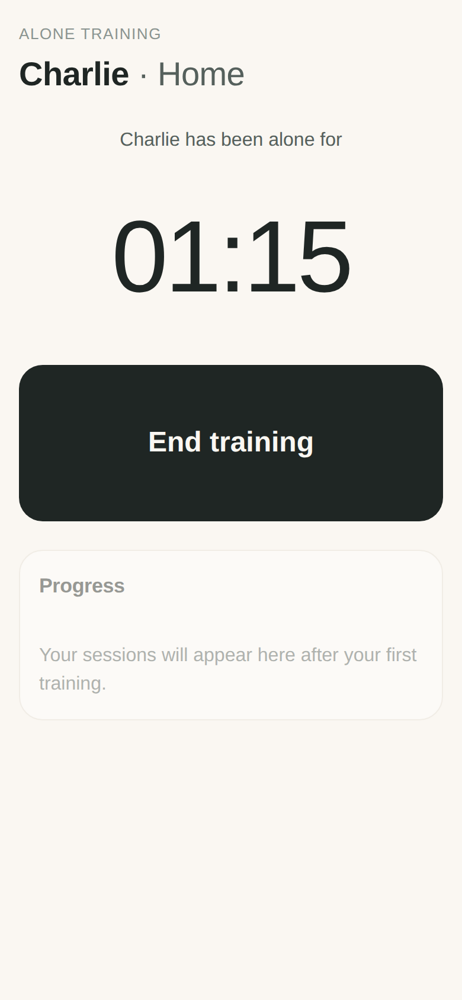
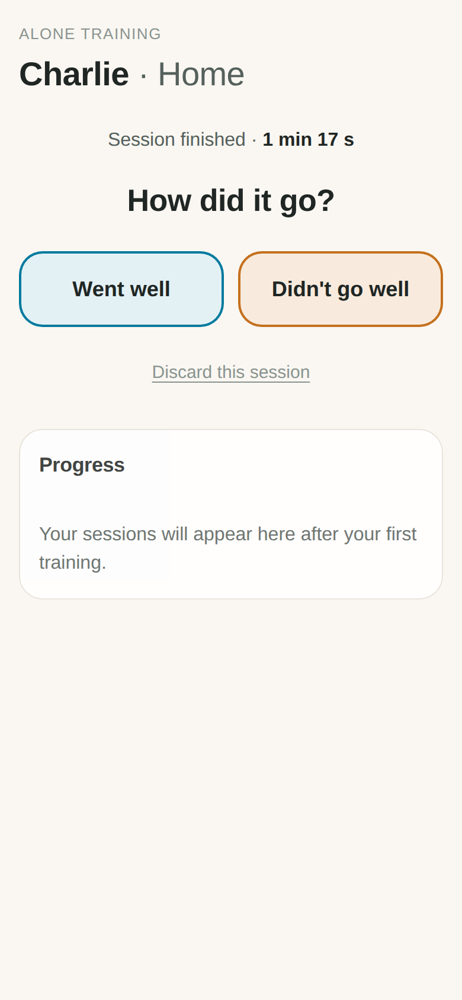
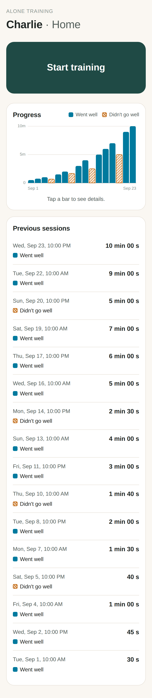

# Alone Time – dog alone-training tracker (v0.1)

A calm, phone-first app for tracking Charlie's alone training at home.

Tap **Start training** → leave → come back and tap **End training** → answer
**Went well / Didn't go well**. Every session is saved with date, duration and
result, shown in a list and a graph.

<p>



</p>

## Get it on your phone

1. On GitHub: **Settings → Pages → Build and deployment → Source: Deploy from a branch**.
   Choose the branch (`main` once this is merged) and folder `/ (root)`, then **Save**.
2. After a minute the app is live at `https://fridakaka.github.io/alone-training-app/`.
3. Open that link on your phone:
   - **iPhone (Safari):** Share button → **Add to Home Screen**.
   - **Android (Chrome):** ⋮ menu → **Add to Home screen** / **Install app**.
4. Open it from the home-screen icon. It runs full-screen and works offline.

Your data is stored **only on that phone**, in that browser. Deleting the app
or clearing Safari/Chrome website data deletes the history.

## How it's built (short version)

See [docs/PLAN.md](docs/PLAN.md) for the plain-language explanation.

| File | What it does |
|---|---|
| `index.html` | The screen |
| `styles.css` | Look & feel, light and dark mode |
| `src/app.js` | Connects buttons to logic and redraws the screen |
| `src/training.js` | The rules: start, end, rate, durations (no screen code) |
| `src/store.js` | Saves/loads data on the phone |
| `src/chart.js` | Draws the graph |
| `sw.js`, `manifest.webmanifest`, `icon*` | Make it installable and work offline |

## For development

Needs [Node.js](https://nodejs.org) 20+.

```sh
npm install        # once
npm start          # open http://localhost:8080
npm test           # logic tests
npm run test:e2e   # clicks through the real app in a phone-sized browser, saves screenshots to test-results/
```

## Not in v0.1 (on purpose)

Multiple dogs, multiple places (Car, Outside shop…), suggested next duration,
notes. The data format already has room for these (`dogs`, `contexts`, and one
record per session), so they can be added without losing saved history.
