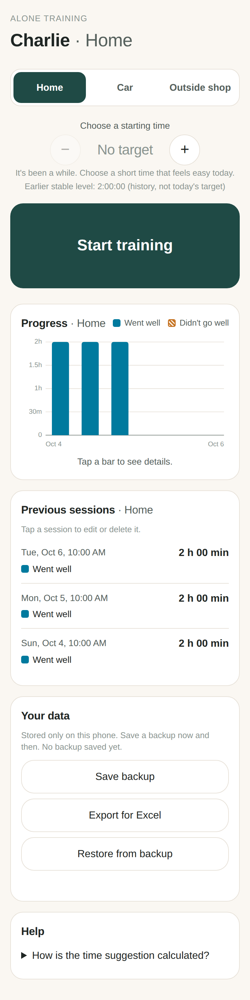

# Alone Time – dog alone-training tracker (v0.7)

A calm, phone-first app for tracking Charlie's alone training in three places:
**Home**, **Car** and **Outside shop**.

Pick the place (remembered from last time) → tap **Start training** → come back and tap
**End training** → answer **Went well / Didn't go well**. Every session is saved with date,
place, target and actual duration, and result. Each place has its own graph, history and
suggested next duration.

<p>



</p>

## Time suggestion

Suggestions are based on recent sessions in this place (last 7 days, max 5 sessions).
Earlier long sessions stay in the history and are shown as "earlier stable level", but don't
automatically decide today's time. A small increase (about +10 %) only after a time has gone
well on different days; with a limited basis the app suggests repeating a time that more than
one session supports; after a hard session it suggests less (below the worry time, if given);
after a break it shows no automatic time. You can always type a time (from 1 second), use − / +,
or train without a target.

Full rules and preliminary parameters: [docs/SUGGESTION-MODEL.md](docs/SUGGESTION-MODEL.md).
The app is a training journal – not advice, and it can't tell how long a dog can be alone.

## Dog name, language, introduction, comments (v0.7)

- **First start** (new users only): choose Svenska/English, enter the dog's name, and read a
  very short introduction (also under *Help → About Alone Time*). Existing data never shows it:
  "Charlie" and all sessions stay until the user changes them.
- **Language**: all interface text is in `src/i18n.js` (English + Swedish, same keys – checked by
  a test). Existing users who haven't chosen see a small optional choice on the main screen (never
  during a session). Changed later under *Settings*. Dates use the chosen language.
- **Default place names**: new users get them in the language chosen at first start
  (Hemma / Bilen / Utanför affären, or Home / Car / Outside shop). After that the names are the
  user's own text: switching language never renames places – default or renamed.
- **Dog name**: *Settings*. Only the label changes; the dog's internal id stays (`charlie`), so no
  session moves.
- **Comment**: optional text on the result screen, saved with *Went well* / *Didn't go well*
  (max 500 characters). Shown shortened in the history, in full when a session is opened, and
  editable/removable there. Comments are never used by the time suggestion.

## App icon

Master artwork: `alone-time-app-icon-1024.png`. Sizes are made with `npm run icons` into
`icons/alone-time-{32,180,192,512}.png` (new file names so browsers don't keep a cached old icon).
**iPhone:** the home-screen icon of an already installed app is not updated automatically by iOS.
To see the new icon, remove Alone Time from the home screen and add it again from Safari
(*Share → Add to Home Screen*). Your data is kept: it belongs to the website, not the icon.

## Place names

The three places (Home, Car, Outside shop) can be renamed under **Place names** further down
the page. Each place keeps a fixed internal id (`home`, `car`, `outside-shop`); sessions point
to the id, so a rename only changes the label – history and suggestions stay with the place.
Names are trimmed, must be unique and non-empty, max 30 characters.

## Editing and backup

- After *Didn't go well* the app asks (optionally) roughly when worry started – or tap *Don't know*.
- Tap a session in *Previous sessions* to change its place, result, duration, target, worry time,
  mark it "don't count as progress", or delete it.
- **Your data** (bottom of the screen): *Save backup* (a file you can keep in Files/iCloud/mail),
  *Export for Excel* (shown place names, a stable *Place ID* column and a *Comment* column;
  text that looks like a formula is prefixed with ' so Excel shows it as text), and *Restore from backup*
  (adds sessions from a backup; never removes any). Backups include your place names. Restoring
  never changes your settings by itself: if the backup's dog name, language or place names differ,
  the app shows them and lets you choose *Use settings from backup* or *Keep my settings*. Backups
  also contain comments. Older backups without these fields change nothing.

## Get it on your phone

1. On GitHub: **Settings → Pages → Build and deployment → Source: Deploy from a branch**.
   Choose the branch (`main` once this is merged) and folder `/ (root)`, then **Save**.
2. After a minute the app is live at `https://fridakaka.github.io/alone-training-app/`.
3. Open that link on your phone:
   - **iPhone (Safari):** Share button → **Add to Home Screen**.
   - **Android (Chrome):** ⋮ menu → **Add to Home screen** / **Install app**.
4. Open it from the home-screen icon. It runs full-screen and works offline.

Your data is stored **only on that phone**, in that browser. Deleting the app
or clearing Safari/Chrome website data deletes the history.

## How it's built (short version)

See [docs/PLAN.md](docs/PLAN.md) for the plain-language explanation and
[docs/PLAN-v0.2.md](docs/PLAN-v0.2.md) / [docs/PLAN-v0.3.md](docs/PLAN-v0.3.md) for what each version added.

| File | What it does |
|---|---|
| `index.html` | The screen |
| `styles.css` | Look & feel, light and dark mode |
| `src/app.js` | Connects buttons to logic and redraws the screen |
| `src/training.js` | The rules: start, end, rate, places, durations (no screen code) |
| `src/suggestion.js` | Time suggestion model (see docs/SUGGESTION-MODEL.md) |
| `src/progression.js` | Rounding, −/+ steps and time formatting |
| `src/backup.js` | Backup file, restore (merge) and Excel export |
| `src/store.js` | Saves/loads data on the phone, upgrades v0.1 data |
| `src/chart.js` | Draws the graph |
| `sw.js`, `manifest.webmanifest`, `icons/` | Make it installable and work offline |
| `src/i18n.js` | All interface text, English and Swedish |

## For development

Needs [Node.js](https://nodejs.org) 20+.

```sh
npm install        # once
npm start          # open http://localhost:8080
npm test           # logic tests
npm run test:e2e   # clicks through the real app in a phone-sized browser, saves screenshots to test-results/
```

## Your data and upgrades

v0.2 stores data under a new key (`alone-training:v2`). On first launch it copies all
v0.1 sessions into **Home**. The original v0.1 data is left untouched on the phone as a backup.

## Not built yet (on purpose)

Multiple dogs, notes, automatic cloud backup.
