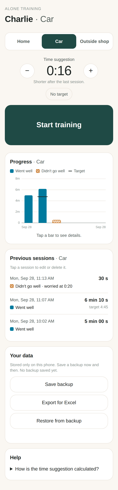
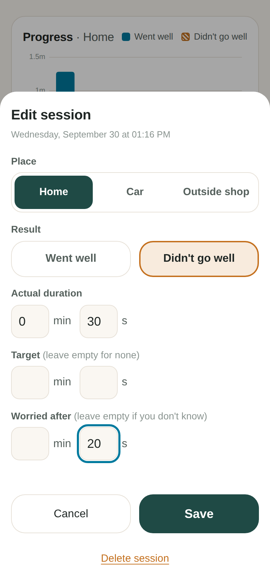
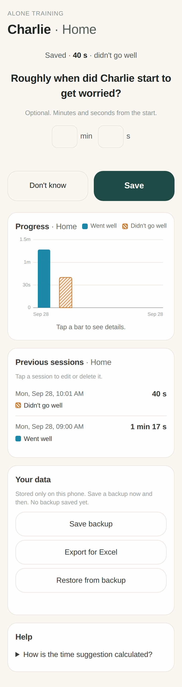

# Alone Time – dog alone-training tracker (v0.4)

A calm, phone-first app for tracking Charlie's alone training in three places:
**Home**, **Car** and **Outside shop**.

Pick the place (remembered from last time) → tap **Start training** → come back and tap
**End training** → answer **Went well / Didn't go well**. Every session is saved with date,
place, target and actual duration, and result. Each place has its own graph, history and
suggested next duration.

<p>



</p>

## Time suggestion

Per place, from the recent logged history in that place only (last 7 days, max 5 sessions).
It suggests a small increase only after a time has gone well several times on different
days, keeps the time otherwise, suggests a shorter time after a hard session (below the
point where worry started, if you enter it), and suggests a careful return after a break.
When there is too little recent history, you choose an easy starting time.
You can always change the time or train without a target.

Full rules and preliminary parameters: [docs/SUGGESTION-MODEL.md](docs/SUGGESTION-MODEL.md).
The app is a training journal: it can't tell how long a dog can safely be alone.

## Editing and backup

- After *Didn't go well* the app asks (optionally) roughly when worry started – or tap *Don't know*.
- Tap a session in *Previous sessions* to change its place, result, duration, target, worry time,
  mark it "don't count as progress", or delete it.
- **Your data** (bottom of the screen): *Save backup* (a file you can keep in Files/iCloud/mail),
  *Export for Excel*, and *Restore from backup* (adds sessions from a backup; never removes any).

## Get it on your phone

1. On GitHub: **Settings → Pages → Build and deployment → Source: Deploy from a branch**.
   Choose the branch (`main` once this is merged) and folder `/ (root)`, then **Save**.
2. After a minute the app is live at `https://fridakaka.github.io/alone-training-app/`.
3. Open that link on your phone:
   - **iPhone (Safari):** Share button → **Add to Home Screen**.
   - **Android (Chrome):** ⋮ menu → **Add to Home screen** / **Install app**.
4. Open it from the home-screen icon. It runs full-screen and works offline.

Your data is stored **only on that phone**, in that browser. Deleting the app
or clearing Safari/Chrome website data deletes the history.

## How it's built (short version)

See [docs/PLAN.md](docs/PLAN.md) for the plain-language explanation and
[docs/PLAN-v0.2.md](docs/PLAN-v0.2.md) / [docs/PLAN-v0.3.md](docs/PLAN-v0.3.md) for what each version added.

| File | What it does |
|---|---|
| `index.html` | The screen |
| `styles.css` | Look & feel, light and dark mode |
| `src/app.js` | Connects buttons to logic and redraws the screen |
| `src/training.js` | The rules: start, end, rate, places, durations (no screen code) |
| `src/suggestion.js` | Time suggestion model (see docs/SUGGESTION-MODEL.md) |
| `src/progression.js` | Rounding, −/+ steps and time formatting |
| `src/backup.js` | Backup file, restore (merge) and Excel export |
| `src/store.js` | Saves/loads data on the phone, upgrades v0.1 data |
| `src/chart.js` | Draws the graph |
| `sw.js`, `manifest.webmanifest`, `icon*` | Make it installable and work offline |

## For development

Needs [Node.js](https://nodejs.org) 20+.

```sh
npm install        # once
npm start          # open http://localhost:8080
npm test           # logic tests
npm run test:e2e   # clicks through the real app in a phone-sized browser, saves screenshots to test-results/
```

## Your data and upgrades

v0.2 stores data under a new key (`alone-training:v2`). On first launch it copies all
v0.1 sessions into **Home**. The original v0.1 data is left untouched on the phone as a backup.

## Not built yet (on purpose)

Multiple dogs, notes, automatic cloud backup.
